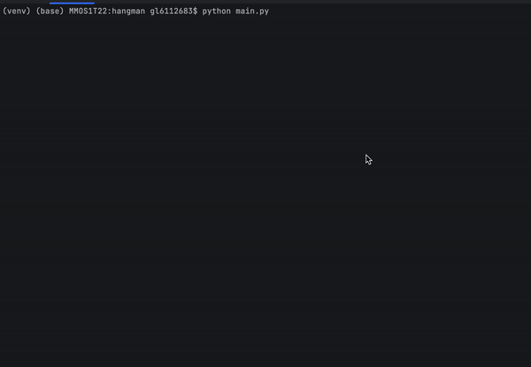

# Hangman
## Overview
Hangman is a classic word-guessing game where one player thinks of a word and the other player tries to guess it by suggesting letters one at a time. The player attempting to guess the word has a limited number of attempts (represented by the "hangman" figure), and the goal is to guess the word correctly before running out of attempts.



## Features
- Play the classic word-guessing game.
- Choose from a wide range of words to guess.
- Customizable difficulty levels, including the number of attempts allowed.
- Track your progress and see your wins and losses.
- Enjoy a fun and interactive way to improve your vocabulary and word-guessing skills.

## How to Play
- Start the game by running the Python script.
- Choose a difficulty level.
- Attempt to guess the hidden word by entering one letter at a time.
- For each incorrect guess, part of the "hangman" figure is drawn.
- Try to guess the word before the hangman is completed to win the game.

## Installation
To play the Hangman game, follow these steps:
- Clone the repository to your local machine.
- Make sure you have Python installed.
- Run the Python script to start the game:
```
python main.py
```

## License
This Hangman game is open-source and available under the MIT License. Feel free to use, modify, and distribute it as needed.

## Acknowledgments
Built with Python, this Hangman game is a fun project for learning and entertainment.